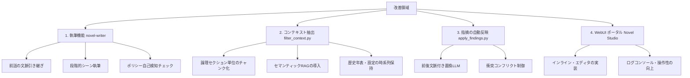

# Novel Tools 機能改善提案書（AI執筆・レビュー）

本ドキュメントは、AIによる小説の執筆およびレビューパイプラインの品質・信頼性を向上させるための具体的な機能改善提案をまとめたものです。他のセッションや別エージェントへ開発を引き継ぐ際の設計資料として活用してください。

---

## 改善の全体マップ

以下の4つの領域に対して改善を提案します。

---

## 1. 執筆機能（`Novel-Writer`）の改善

### ① 前話の文脈引き継ぎ（コンテキストリレー）
*   **課題**: 現在は対象エピソードのプロット、全体ポリシー、キャラクター概要のみを参照して執筆しています。そのため、直前のエピソード（例: `novels/1_11.txt`）でのキャラクターの物理的状況（怪我の有無、所持品、位置関係）や直前の会話トーンが引き継がれず、物語の連続性に矛盾が発生することがあります。
*   **解決案**:
    *   執筆対象エピソードの「直前のエピソードファイル」（`X_(Y-1).txt`）の末尾約1,000〜1,500文字を自動で取得。
    *   プロンプトに「【前話の終盤部分（参考）】」として動的に追加する仕組みを `writer_cli.py` に実装する。
*   **効果**: エピソード間のつながりが自然になり、プロットの破綻を防げます。

### ② 段階的（ステップバイステップ）シーン執筆
*   **課題**: 1話分（3,000〜5,000文字程度）の長文をLLMに一発で書かせると、展開が駆け足になったり、執筆ポリシーの適用が途中で雑になったりします。
*   **解決案**:
    *   プロットに記載されている起承転結などのシーン、またはマイルストーンごとに生成を分割して実行する。
    *   「第1シーンの生成」→「人間による確認・修正」→「第2シーンの生成（第1シーンのテキストを文脈に追加）」というマルチターン（段階的）執筆ワークフローを導入する。
*   **効果**: 描写の密度が向上し、ペーシングの崩れを防ぐことができます。

### ③ 執筆ポリシーの自己検知フィードバックループ
*   **課題**: 生成された小説本文に、執筆ポリシーに反する表記（ルビのルール違反、禁止された単語やトーンの使用など）が稀に含まれてしまう問題。
*   **解決案**:
    *   小説の生成完了直後に、静的なルールバリデータ（ルビの形式チェックなど）や、軽量なLLMによる「ポリシーチェッカー」をバックグラウンドで実行。
    *   違反箇所の検出時、その箇所とその周辺文脈を指定してLLMに部分再生成（リライト）を要求し、修正した上で保存する。
*   **効果**: 手動で修正を適用する手間が大幅に削減されます。

---

## 2. コンテキスト抽出（`filter_context.py`）の改善

### ① 論理セクション単位のチャンク化
*   **課題**: 現在は設定ファイルを単なる「ダブル改行（パラグラフ単位）」で機械的に分割してTF-IDFで類似度評価しています。これにより、設定資料の中の見出しや連続する論理的な説明がバラバラに引き裂かれ、順順不同で抽出されるため、LLMが設定の前提条件を正しく解釈できないケースが発生します。
*   **解決案**:
    *   Markdownのヘッダー（`#`, `##`, `###`）や、特定の区切り文字（`■` などの見出し）を検知し、論理的な意味のまとまりごとにチャンク分割するよう `filter_context.py` を改良する。
*   **効果**: 抽出された設定の可読性が向上し、LLMによるレビューの精度が高まります。

### ② ベクトル類似度（Embedding）によるセマンティックRAGの導入
*   **課題**: 単純な部分一致および単語出現頻度（TF-IDF）に基づくため、「表記ゆれ（アルフとアルフレッド）」や「同義語・類義語」が含まれる場合に設定の抽出漏れが発生します。
*   **解決案**:
    *   ローカルの軽量Embeddingモデル（あるいはAPI）を利用して設定チャンクをベクトル化。
    *   執筆中の小説テキストとのコサイン類似度で関連設定を検索する仕組みへ移行する。
*   **効果**: 表記ゆれに左右されず、真に関連度の高い設定資料がレビュー用コンテキストに抽出されます。

### ③ 時系列情報（年表等）の順序維持と優先抽出
*   **課題**: 歴史年表（`02_創世記から現代まで.txt`）などは、断片化されて順不同になると歴史の因果関係がLLMに伝わりません。
*   **解決案**:
    *   年表や世界観の基本ルール（物理法則や魔力体系など）を記述したファイルは、チャンク化から除外し、常に「基本コンテキスト」として優先的に（断片化せずに）プロンプトに含めるよう制御する。
*   **効果**: 歴史設定の矛盾や、世界観の根本的なロジックエラー（World-Logic-Guard）の検知精度が劇的に向上します。

---

## 3. 指摘の自動反映（`apply_findings.py`）の改善

### ① 前後文脈（コンテキスト）を含めた書き換えLLMの実行
*   **課題**: 現在、指摘の反映時には「指摘箇所の原文」と「修正案」のみをLLMに渡して置換テキストを作成しています。前後の文章が渡されないため、修正後のテキストが周囲の文体や口調（一人称、ですます調、キャラクターごとの特有の話し方）と食い違う不自然な文章に書き換えられることがあります。
*   **解決案**:
    *   `apply_finding_to_text` 内で、該当行の前後3〜5行を含めた「コンテキストブロック」を一時的に抽出。
    *   LLMに対して「この前後の文脈に完全に馴染むように、該当箇所を修正してください」という指示と共に文脈ブロックごと渡し、置換後のブロックを生成させる。
*   **効果**: 前後の流れに完全に溶け込む、極めて自然な自動修正が可能になります。

### ② 衝突（コンフリクト）防止と差分マージ（Unified Diff）の導入
*   **課題**: 同一箇所や隣接する行に複数の指摘が集中している場合、1つ目の修正を適用した瞬間に元の行の文字列が変化するため、2つ目以降の適用が「原文不一致」で失敗（Failed）します。
*   **解決案**:
    *   単純な文字列置換ではなく、Unified Diff（差分パッチ）を作成し、これを適用するロジック（`patch` コマンドの模倣）を実装する。
    *   もしくは、複数の修正項目がある同一ブロック全体を抽出し、一度のLLM呼び出しでまとめて書き換える「一括コンテキスト適用」を行う。
*   **効果**: 「適用失敗」の発生率が大幅に減少し、複数指摘の一括自動反映が安定します。

---

## 4. WebUI（`Novel Studio`）のUX改善

### ① インタラクティブなインライン編集機能（WYSIWYG/Markdown）
*   **課題**: 現在、指摘を「Apply（反映）」した後の小説本文をブラウザ上で直接修正できません。AIによる自動修正に微細な調整が必要な場合、ユーザーは別のテキストエディタを起動してファイルを開き直す必要があります。
*   **解決案**:
    *   WebUI上の「Editor」画面に、反映後の小説テキスト（`01_formatted.txt`）をその場で直接編集・保存できるリッチテキスト/Markdownエディタ（例: Quill, SimpleMDE等）を組み込む。
*   **効果**: 「校閲実行 → 指摘の選択 → 自動反映 → 人間による微調整・保存」というサイクルがWebUI単体でシームレスに完結します。

### ② 反映状況の視覚的フィードバックとロールバック機能
*   **課題**: どの指摘が現在反映済みで、どの指摘が未反映なのか、また反映後に不具合があった場合に元の状態に戻す手段がWebUI上にありません。
*   **解決案**:
    *   指摘リストの横に「反映ステータス（成功/失敗/未反映）」をバッジで表示する。
    *   反映処理を実行する前に、自動で `01_formatted.txt` のバックアップ（Gitのコミット、またはテンポラリファイル）を作成し、ワンクリックで「元に戻す（Rollback）」ができるボタンをWebUIに設置する。
*   **効果**: 安心して自動反映機能を試せるようになり、安全性が向上します。

---

## 開発ロードマップ（優先度提案）

これらの改善を行うにあたり、手間の少なさと効果の大きさ（投資対効果）を考慮した推奨の実施順序です。

1.  **【優先度: 高 / 難易度: 低】指摘反映の文脈付き書き換え (`apply_findings.py`)**
    *   自動マージされた文章の質を劇的に向上させるため、最も最初に行うべき改善です。
2.  **【優先度: 高 / 難易度: 中】論理セクション単位のチャンク抽出と時系列保持 (`filter_context.py`)**
    *   レビューの「設定矛盾の検知精度」を向上させ、誤検知を減らすための基盤整備です。
3.  **【優先度: 中 / 難易度: 中】WebUI上でのインラインエディタの実装 (`review_server.py` & フロントエンド)**
    *   推敲のUXを大幅に高め、ツールとしての完成度を一気に引き上げます。
4.  **【優先度: 中 / 難易度: 高】前話の文脈引き継ぎ（コンテキストリレー）および段階的執筆 (`writer_cli.py`)**
    *   執筆エンジン側の強化で、自動生成された初稿のクオリティアップに繋げます。
